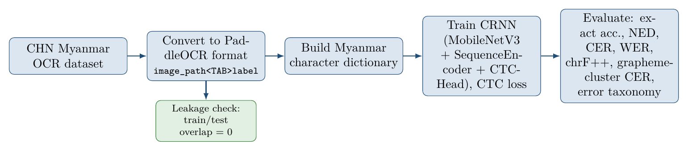
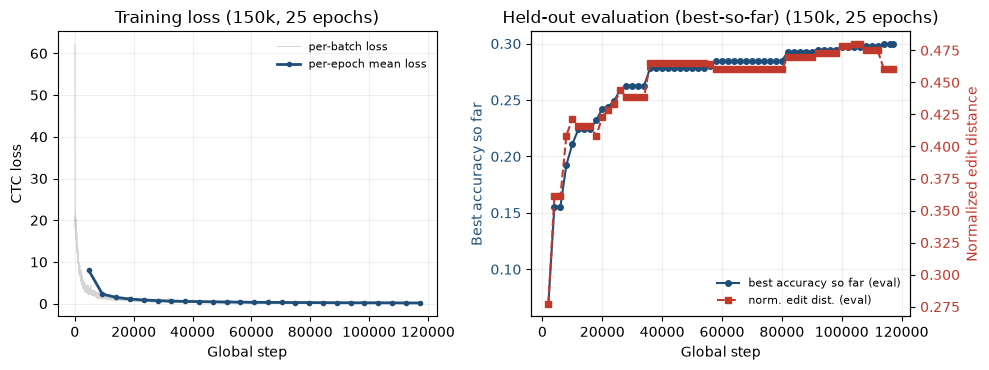
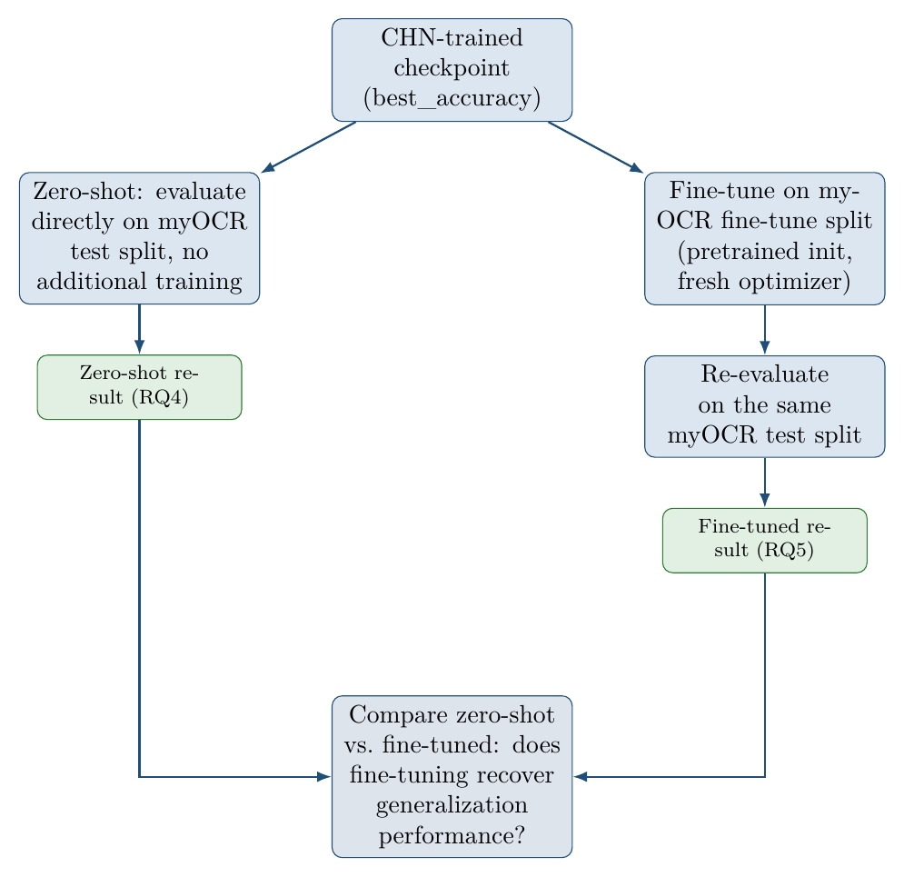

# Myanmar OCR Project

Myanmar text recognition using PaddleOCR, built from scratch on the CHN Myanmar OCR
dataset, with a Myanmar-script-specific error analysis and an explicit test of
cross-dataset generalization to the myOCR dataset.

This project focuses on the **recognition** stage of OCR: the input is already a
cropped Myanmar text-line image, and the model predicts the corresponding text
sequence. It does not perform text detection or full-page OCR.

## Research Questions

- **RQ1:** Can PaddleOCR be adapted to train a Myanmar text recognition model using a
  custom Myanmar character dictionary and cropped text-line images?
- **RQ2:** What baseline recognition performance can a CRNN-based PaddleOCR recognizer
  achieve on the CHN Myanmar OCR dataset?
- **RQ3:** What types of recognition errors remain, and how do they break down by
  Myanmar-specific character category and by sequence length?
- **RQ4:** How well does a model trained on CHN generalize to a different Myanmar OCR
  dataset (myOCR), evaluated zero-shot?
- **RQ5:** Does fine-tuning on a small sample of the target dataset recover
  generalization performance, and by how much?

The full write-up, with methodology, related work, and a QA section addressing
reviewer questions, is in the accompanying paper (`paper/` — ACL format).

## Pipeline



The leakage check is a real verification step, not a formality: train/test image-path
and exact-line overlap were both confirmed at **0** before trusting any result below.

## Framework and Model

| | |
|---|---|
| Framework | PaddleOCR (recognition-only) |
| Algorithm | CRNN |
| Backbone | MobileNetV3 (scale 0.5, "large") |
| Neck | SequenceEncoder (RNN, hidden size 96) |
| Head | CTCHead |
| Loss | CTCLoss |
| Dictionary | Custom, built from the CHN dataset's own labels |
| Training | From scratch, no pretrained Burmese OCR model |

## Results

### CHN Baseline (final: 150,000 train / 5,000 test / 25 epochs)

| Metric | Value |
|---|---|
| Exact sequence accuracy | 35.46% |
| CER | 63.02% |
| Grapheme-cluster CER | 65.84% |
| WER | 74.17% |
| chrF++ | 28.88 |

**A note on how these numbers were computed:** PaddleOCR's own internally reported
accuracy disagreed with accuracy computed directly from matched
(ground-truth, prediction) pairs by as much as 15 percentage points, in *inconsistent
directions* across two separate training runs. All numbers in this repo and the paper
are computed from predictions explicitly matched to ground truth by image filename
(see `scripts/04_evaluate_predictions.py` and `scripts/07_myanmar_error_analysis.py`),
independent of PaddleOCR's internal metric. If you're extending this project, verify
your own numbers the same way rather than trusting `tools/eval.py`'s printed accuracy
directly.



### Error Taxonomy (CHN test set, 71,509 total errors)

| Error type | Count | Share |
|---|---|---|
| Substitution | 46,824 | 65.5% |
| Deletion | 21,624 | 30.2% |
| Insertion | 3,061 | 4.3% |
| Diacritic/stacking-related | 13,076 | 18.3% |

Error rate climbs sharply with sequence length: **31.3%** (≤3 grapheme clusters) →
**53.0%** (4–8) → **74.8%** (9–15) → **88.5%** (>15). This held in both a 20k pilot run
and the final 150k run, at every training scale, pointing to an architectural
limitation (a fixed 100px input width limits how many CTC output time-steps are
available for long sequences), not a data-volume problem.

Grapheme-cluster CER (65.84%) was *higher* than character-level CER (63.02%),
consistently, across every setting evaluated in this project (also true on the 20k
pilot run and on myOCR after fine-tuning). Likely mechanism: dropping or substituting
a stacking mark can shift how surrounding characters group into clusters, so a small
number of character-level edits cascade into more cluster-level mismatches. This is a
genuine property of evaluating a stacking script like Myanmar, not a metric artifact.

### Cross-Dataset Generalization (CHN → myOCR)



| Setting | Exact Accuracy | CER | Grapheme CER |
|---|---|---|---|
| Zero-shot | 1.92% | 35.10% | 42.17% |
| Fine-tuned (10 epochs, 7,673 images) | 24.68% | 9.09% | 12.20% |

Zero-shot generalization collapses (1.92% exact accuracy vs. 35.46% in-domain), but a
dictionary coverage check ruled out vocabulary mismatch as the cause (myOCR has 89
unique characters; only 11 are non-Myanmar formatting characters, not script glyphs).
The likely explanation is visual/font domain shift, not missing script coverage,
supported by zero-shot predictions showing ~2.5x more character insertions per sample
than in-domain CHN predictions (consistent with the model hallucinating characters
when faced with an unfamiliar visual style).

Fine-tuning on a small sample (7,673 images, 10 epochs) recovers most of the gap: a
**12.9x relative improvement** in exact accuracy, CER cut by 74%. The base CHN-trained
features are transferable; they just need exposure to the target visual domain.

## Limitations

- Recognition-only; no text detection or full-page OCR.
- Trained from scratch; a pretrained-backbone comparison was not completed (pretrained
  PaddleOCR rec checkpoints use non-Myanmar dictionaries, so their output layer can't
  be loaded directly). Named as explicit future work, not skipped silently.
- Cross-dataset evaluation used a single myOCR train/test split; not averaged over
  multiple seeds.
- Long (15+ character) and mixed-script lines see accuracy collapse, a limitation of
  the fixed-width CRNN architecture rather than of the training data.

## Repo Structure

```
Myanmar-OCR-Project/
├── assets/                  # README images
├── configs/                 # PaddleOCR training configs (150k final, myOCR fine-tune, etc.)
├── data/
│   ├── chn_subset/          # CHN labels + dictionary (images gitignored)
│   └── myocr/                # myOCR labels (images gitignored)
├── scripts/
│   ├── 01-06_*.py            # Dataset prep, dictionary build, config generation
│   ├── build_myocr_subset.py     # Convert myOCR HF dataset -> PaddleOCR format
│   ├── build_predictions_csv.py  # Merge raw inference output with ground truth
│   ├── 04_evaluate_predictions.py # CER / WER / chrF++ (verified, not PaddleOCR-internal)
│   ├── 07_myanmar_error_analysis.py # Grapheme-cluster CER + error taxonomy
│   └── plot_training_curve.py    # Parses train.py logs into a training curve figure
├── logs/                    # Real training logs (150k final run, myOCR fine-tuning)
├── results/                 # Real predictions, CER/taxonomy JSON, failure-case tables
└── outputs/                 # Model checkpoints (gitignored, large)
```

## Setup

```bash
python -m venv .venv
source .venv/bin/activate
pip install -r requirements.txt
```

See `docs/PUFFER_SETUP.md` for the full PaddleOCR training environment setup.

## Reproducing the Final Results

```bash
# Train (150k images, corrected max_text_length=200 to avoid silent
# label truncation, see configs/myanmar_rec_config_150k_fixed.yml)
python ~/PaddleOCR/tools/train.py -c configs/myanmar_rec_config_150k_fixed.yml

# Inference on the full CHN test set
python ~/PaddleOCR/tools/infer_rec.py \
  -c configs/myanmar_rec_config_150k_fixed.yml \
  -o Global.checkpoints=outputs/puffer_2080ti_150k_fixed/best_accuracy \
     Global.infer_img=data/chn_subset/test_images \
     Global.save_res_path=results/raw_infer_150k_fixed_test5000.txt

# Merge predictions with ground truth, then compute verified metrics
python scripts/build_predictions_csv.py \
  --pred_file results/raw_infer_150k_fixed_test5000.txt \
  --gt_file data/chn_subset/rec_gt_test.txt \
  --out_csv results/sample_predictions_150k_fixed.csv
python scripts/04_evaluate_predictions.py --input results/sample_predictions_150k_fixed.csv
python scripts/07_myanmar_error_analysis.py --input results/sample_predictions_150k_fixed.csv
```

## Paper

Full ACL-format paper with methodology, related work, and a QA section addressing
reviewer feedback: see `paper/myanmar_ocr_acl.pdf`.